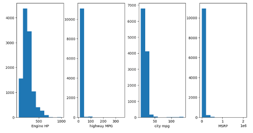
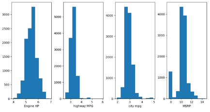
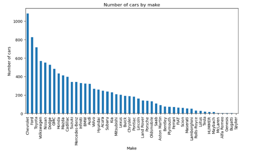
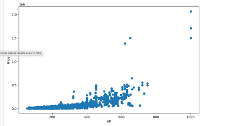
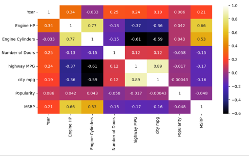
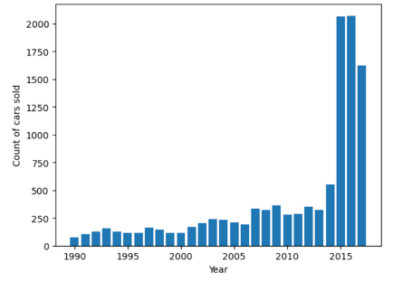
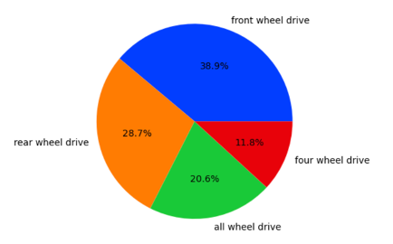
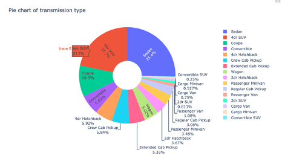

# EDA on Cars Dataset
> **Created by:** Nisarg Patel
- Implemented diverse visualizations to get the insights from the cars dataset.
- Cleaned each feature thoroughly to get maximum insights.
- Created a ML model model to prdict the car price with the accuracy of 92%.

## Code and resources used:
**Pyrhon Vesion :** 3.9  
**Packages :** pandas, numpy, matplotlib, seaborn, sklearn, plotly  

## Dataset
- The dataset was provided by one of our professor Mohhamed Saiful islam (https://www.linkedin.com/in/mohammadsaifulislam/).
- The dataset have total 12000 entries.
- The dataset have 16 diverse features which are mentioned below:
  - **Make**
  - **Model**
  - **Year**
  - **Engine Fuel Type**
  - **Engine HP**
  - **Engine Cylinders**
  - **Transmission Type**
  - **Driven_Wheels**
  - **Number of Doors**
  - **Market Category**
  - **Vehicle Size**
  - **Vehicle Style**
  - **highway MPG**
  - **city mpg**
  - **Popularity**
  - **MSRP**

 ## Data cleaning 

  
- It can be seen from the above picture that the dataset had 5 features which have missing values in it here we handle missing values in each feature seperately.

  **1 Engine_hp**
  - Here we have used Mode to replace NaN values for each make using their model.
  - For ex: For FIAT cars we found **Mode** from its model and **replace** all the **NAN values in FIAT car's** with that **MODE** and similarly we did this for each car make (Lincoln, Ford, Honda, Mitsubishi, Nissan, Tesla, Toyota and more,,).
  
  **2 Engine Fuel type**
  - We had 3 entries in which we had NAN in Engine Fuel Type column.
  - All three entries are from **Suzuki** cars and all other Suzuki cars had **regular unleaded fuel type** so here also we decided to go with **MODE** to remove null values.

  **3 Engine Cylinders**
  - After feature engineering, we got to know that the we only had **NaN** value in **electric cars** and **mazda's cars**.
  - **Electric cars don't have Cylinder** so we **replaced** the **NAN** with **0**.
  - In mazda, **mazda rx-7, mazda rx-8** are **sports cars** and they were desined with unique **rotary engine** instead of **piston engines** which do not use piston so that cars do not need cylinder so we replaced the **NAN** with **0**.
 
  **4 Number of Doors**
  - After feature engineering, we got to know that the only **Ferari** and **Tesla** had missing values in this column.
  - After doing some gooogle search on both model we got to know that **Ferarri** and **tesla** cars are typically equipped with **2** and **4** doors respectively.
  - Still, we use **Mode** for each model and replace NAN with respecrive MODE, and it was **2** and **4** for **Ferarri** and **Tesla**.
 
  **5 Market Category**
  - We dropped this column for the smooth flow.
>
  ## Outlier detection and handling
  - We used boxplot to plot the outliers and Engine_hp, highway MPG, city MPG, and MSRP columns. 
   
     
  
  - As we can see in the above picture there are outliers and using upper limit and lower limit we got to know about the total number of the outliers and each column which was **825, 941, 898, 2324** respectively.
  - Removing all this outliers would not be a good option we could lose so many important information so we thought of using **log transformation**. 
   
   
  - The above histogram shows the distribution of data **before** applying the log transformation. 
   
   
  
  - **After** applying the log transformation, it **ractifies the skewness** in data distribution.

  ## Visualization 
  **1 Numbers of cars by its Make** 
   
    

  - Top 5 car selling companies were **Chevrolte**,**Ford**,**Toyota**,**volkswagen**, and **Nissan**. 
  
  **2 Price by Engine HP**  
   
   

  - We can say that the majority of the cars are within 100 to 500 HP.
  - As the HP increases the price of the car also increases. 
  
  **3 Heatmap** 
    
   
  
  - From the above heatmap we can that there is **highly positive correlation between** **highway**, **city mpg** and **number cylinders**.
  - Moreover, there is **highly negative correlation between highway MPG and City MPG** 

  **4 Number of cars sold by year** 
   
   

  - From the above picture we can say that the number of cars sold **after 2012** were surprisingly **higher**. 

  **5 Pie chart : Driven Wheels** 
   
   
  
  - People have **prefered front wheel drive** over Rear, all,and four wheel drive.  

  **I-Pie chart: Style of model** 
   
   

  - People have predered **Sedan** and **4dr suv**.
   

  ## Model Building and Performance

  - We split the data into train and tests sets with a test size of 20%.

  - **Random forest Regression:** We thought of using random forest regression by considering sparcity associated with the data.

  - **Accuracy:** we got the accuracy of 92% on the test data.

## Huge thanks to:
- **Darshan Ruparel (Team mate) :** https://github.com/DarshanR24, https://www.linkedin.com/in/darshanruparel/  

- **Mohhamed Saiful islam (Professor):** https://github.com/msi-ru-cs , https://www.linkedin.com/in/mohammadsaifulislam/ .  

Nisarg Patel © 2024

 

  
     

 
 
    

